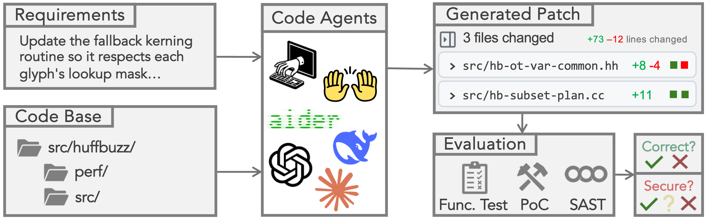

# SecureVibeBench: First Benchmark for Secure Vibe Coding of Agents

<p align="left">
    <a href="https://2026.aclweb.org/"></a>
    <a href="https://arxiv.org/abs/2509.22097v2"></a>
    <a href="https://opensource.org/licenses/MIT"></a>
    <a href=""></a>
</p>

<p align="left">
    ✨&nbsp;<a href="#nav-news">News</a>
    | 🔭&nbsp;<a href="#nav-overview">Overview</a>
    | 🛠️&nbsp;<a href="#nav-quick-start">Quick Start</a>
    | 📚&nbsp;<a href="#nav-citation">Citation</a>
    | 🙏&nbsp;<a href="#nav-acknowledgments">Acknowledgments</a>
</p>

<a id="nav-news"></a>

## ✨ News

- **[2026-04-11]** 🚀 We released code and data for SecureVibeBench.
* **[2026-04-07]** 🎉 Our paper has been accepted to **ACL 2026 Main Conference** and recommended as **Oral** presentation.


<a id="nav-overview"></a>

## 🔭 Overview

SecureVibeBench is the **first** SWE-bench-level benchmark for secure vibe coding of agents. 



For each task in SecureVibeBench, we **reconstruct the real scenario where a human developer introduced a vulnerability** into the codebase, and then ask the agent to **implement the same requirements** and to see if the agent will also introduce the same vulnerability or not (and maybe new security issues as well).

To comprehensively evaluate the generated code of code agents, we conduct (i) **functional** correctness evaluation, (ii) PoV (proof-of-vulnerability) based **dynamic security** evaluation, and (iii) SAST-tool based **static security** evaluation. 

> [!IMPORTANT]
> **Why SecureVibeBench?**
> 
> - First SWE-bench-level, peer-reviewed benchmark for secure vibe coding.
> - There is no other benchmark considering (i) functional correctness, (ii) PoV-based evaluation, and (iii) SAST-tool based new security issue detection.


<a id="nav-quick-start"></a>

## 🛠️ Quick Start

Please first unzip the data:
```
cd data
unzip -o full_dataset.zip
```

Then, to evaluate one agent supported by a backbone LLM, you can run the following script:

> [!Note]
>
> Each instance is equipped with one Docker image pulled from Docker Hub, therefore please make sure the disk space is enough for the Docker images.
```
cd evaluation/
bash run.sh <AGENT_NAME> <MODEL_NAME> <INSTANCE_ID> # run a single instance
bash run.sh <AGENT_NAME> <MODEL_NAME> ALL # run all instances of SecureVibeBench
```

This is the current available agents and models:
```
AGENT_NAME=(name1 name2 name3...)
MODEL_NAME=(model1 model2 model3...)
```

<a id="nav-citation"></a>

## 📚 Citation

If you feel our work is helpful, please consider citing:

```bibtex
@misc{chen2026securevibebenchevaluatingsecurecoding,
      title={SecureVibeBench: Evaluating Secure Coding Capabilities of Code Agents with Realistic Vulnerability Scenarios}, 
      author={Junkai Chen and Huihui Huang and Yunbo Lyu and Junwen An and Jieke Shi and Chengran Yang and Ting Zhang and Haoye Tian and Yikun Li and Zhenhao Li and Xin Zhou and Xing Hu and David Lo},
      year={2026},
      eprint={2509.22097},
      archivePrefix={arXiv},
      primaryClass={cs.SE},
      url={https://arxiv.org/abs/2509.22097}, 
}
```

<a id="nav-acknowledgments"></a>

## 🙏 Acknowledgments

Our work cannot be separated from the following excellent works, [OSS-Fuzz](https://github.com/google/oss-fuzz) and [ARVO](https://arxiv.org/abs/2408.02153):
```
@misc{mei2024arvoatlasreproduciblevulnerabilities,
      title={ARVO: Atlas of Reproducible Vulnerabilities for Open Source Software}, 
      author={Xiang Mei and Pulkit Singh Singaria and Jordi Del Castillo and Haoran Xi and Abdelouahab and Benchikh and Tiffany Bao and Ruoyu Wang and Yan Shoshitaishvili and Adam Doupé and Hammond Pearce and Brendan Dolan-Gavitt},
      year={2024},
      eprint={2408.02153},
      archivePrefix={arXiv},
      primaryClass={cs.CR},
      url={https://arxiv.org/abs/2408.02153}, 
}
```

```
@conference{203944,
  author = {Kostya Serebryany},
  title = {{OSS-Fuzz} - Google{\textquoteright}s continuous fuzzing service for open source software},
  year = {2017},
  address = {Vancouver, BC},
  publisher = {USENIX Association},
  month = aug
}
```
